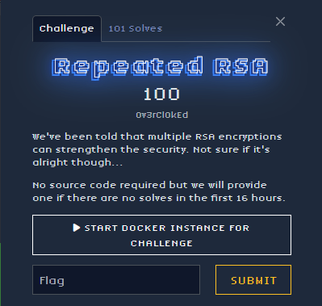

## Description

## Solve

    We have an encrypted flag and three RSA public keys (n1, n2, n3) with the same exponent e=65537. The flag was encrypted multiple times: first with (e, n1), then that result with (e, n2), and finally with (e, n3). We need to reverse the process to decrypt the flag.

## Thought Process

    To decrypt, we need the private keys for n1, n2, and n3. This requires factoring each modulus. However, the moduli are large, but they might share common prime factors (a common vulnerability when keys are generated poorly). If we find that n1, n2, and n3 share factors, we can easily factor them all.

Find Common Factors:

    Compute p = gcd(n1, n3)

    Compute q = gcd(n1, n2)

    Compute r = gcd(n2, n3)
    This reveals that:

    n1 = p * q

    n2 = q * r

    n3 = r * p

Compute Private Keys:
For each modulus, compute Euler’s totient function:

    φ(n1) = (p-1)*(q-1)

    φ(n2) = (q-1)*(r-1)

    φ(n3) = (r-1)*(p-1)
    Then compute the private exponents:

    d1 = modular inverse of e mod φ(n1)

    d2 = modular inverse of e mod φ(n2)

    d3 = modular inverse of e mod φ(n3)

The encryption order was: flag → encrypted with n1 → encrypted with n2 → encrypted with n3.
So we decrypt in reverse:

    Decrypt the given ciphertext with n3 (using d3) to get the intermediate value after n2 encryption.

    Decrypt that result with n2 (using d2) to get the intermediate after n1 encryption.

    Decrypt that result with n1 (using d1) to get the original flag.

## The flag

    ctf{3c1315f63d550570a690f693554647b7763c3acbc806ae846ce8d25b5f364d10}