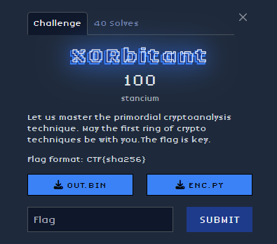

## Description

## Solve

    We are given an encrypted file `out.bin` and the encryption script `enc.py`. The script XORs the contents of `plaintext.txt` with a key (the flag) and writes the result to `out.bin`. The goal is to recover the flag (the key) from the encrypted data.

### Step 1: Understand the Encryption
    The encryption script uses a repeating XOR cipher:
    - The key is the flag, stored in the environment variable `FLAG` (default: `CTF{example_flag}`).
    - The plaintext is processed in chunks of 4096 bytes.
    - Each byte of the plaintext is XORed with a byte of the key, which repeats cyclically.

### Step 2: Approach to Decryption
    Since the key is the flag and the flag format is `CTF{...}`, we can use statistical methods. We assume the plaintext is English text, where the space character (0x20) is the most frequent. For each key position:
    - Group ciphertext bytes encrypted with the same key byte.
    - Find the most frequent byte in each group.
    - XOR it with 0x20 (space) to recover the key byte.

## Code implementation

## The flag

    CTF{940a422746b832e652a991d88d31eb4d0ab2774a1f9a637e746b9226dfd44bca}
