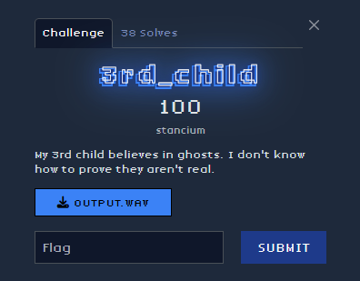
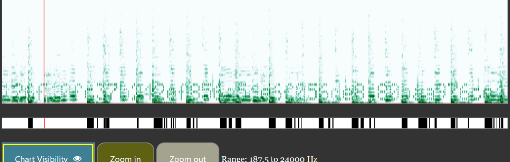
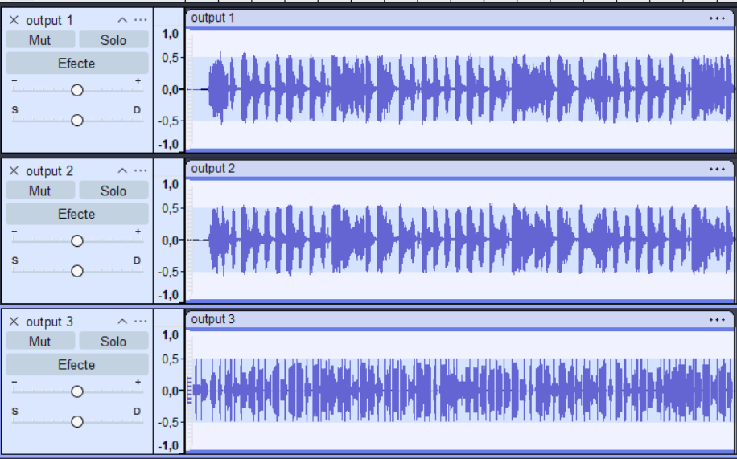
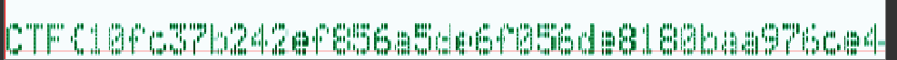
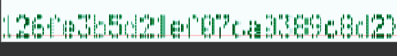

## Description

## Solve

    We are given a .wav file that has a hidden mesasge overlaping a song.
    through the use of sound editing tools we can remove the music and remain only with the code.
    After some inspection, we can see that the flag is hidden in the spectrogram.

## Thought Process

    When presented with a .wav file in CTFs, the first assumption is that the challenge involves steganography in audio.
    
    Since the file also contained music, the next step was to check whether the hidden content was layered in the frequency spectrum.
    
    I used Audacity to remove the music so that the code have a bettere visibility

    

    Than, I used a morse code analizer that let me see the flag

    
    

## The flag
    CTF{10fc37b242ef856a5de6f056de8180baa976ce4126fe3b5d21ef07ca0389c8d2}