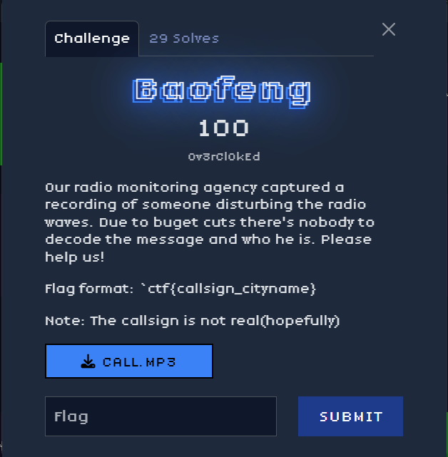
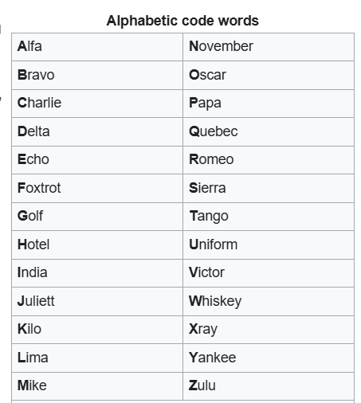

This challange was very interesting because at the beginning i was very confused, i did what everyone's first thought was: to eliminate the noise to hear what the person was saying.

I got a clean version of it and all i noticed were some random words. After a random search on the interenet of the words sierra sierra and tango, i got the NATO phonetic alphabet: https://en.wikipedia.org/wiki/NATO_phonetic_alphabet

what i got from the call was: yankee oscar two tango sierra sieera/ kilo november fifteen kilo sierra meaning ctf{yo2tss_kn15ks} but the flag needed ctf{callsign_cityname}, and with another search KN15KS is a Maidenhead grid locator that points to Hunedoara, Romania (roughly 45.77° N, 22.88° E) was Hunedoara, and the final flag was: ctf{yo2tss_Hunedoara}