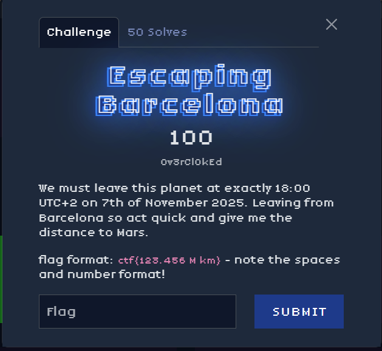
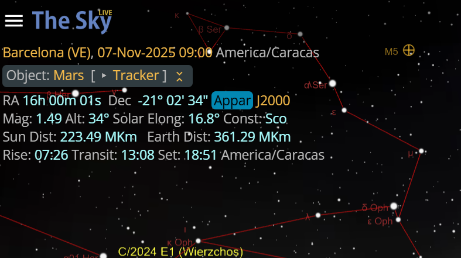

## Description

> We must leave this planet at exactly 18:00 UTC+2 on 7th of November 2025. Leaving from Barcelona so act quick and give me the distance to Mars.
>
> **flag format: ctf{123.456 M km} - note the spaces and number format!**

---

## Solve

My first instinct was to find a site that help me indicate with big precision the exact distancwe.
I used this: https://theskylive.com/how-far-is-mars and at first when i entered Barcelona it gave me a wrong distance so i thought it was a different Barcelona from Venezuella. I know it was not the intended way of solving this but odly enough it worked.

The flag was: ctf{361.290 M km}