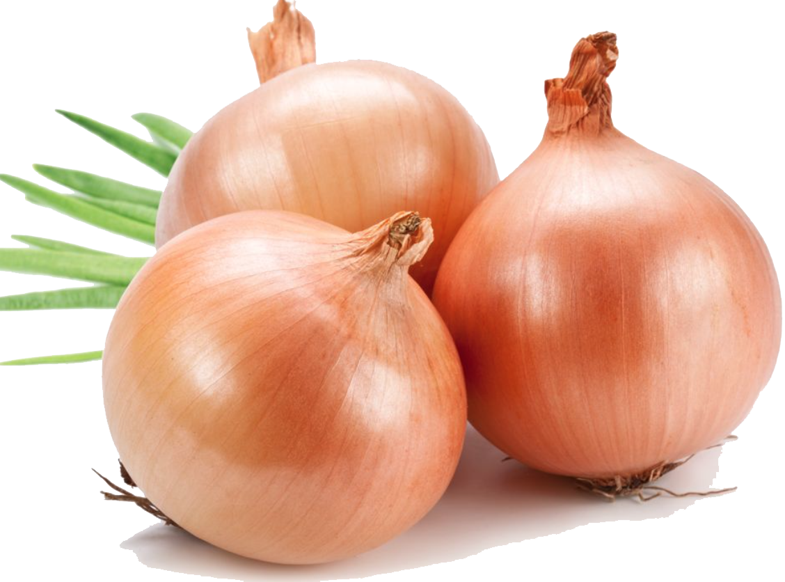
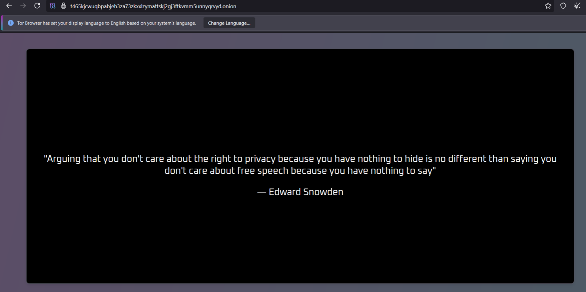

## Description

>This time you might cry...

>

---

## Solve

This time I was given a photo with an onion which hid a .onion site:
t465kjcwuqbpabjeh3za73zkxxlzymattskj2gj3ftkvmm5unnyqrvyd.onion.

Once there, nothing looked suspicious at first, but in editor mode I noticed a custom font being used. I downloaded the font file which looked like random keyslams, but after running it through a Morse decoder it revealed coordinates. At those coordinates I found Mechanics University, where there was a photo with a QR code that gave me the flag.

