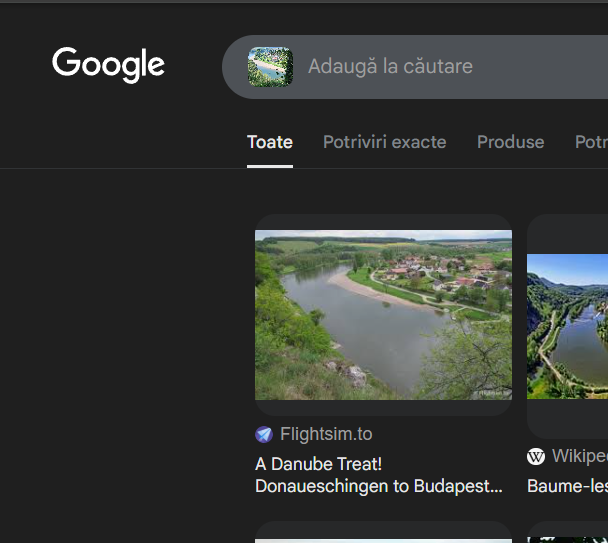

## Description

>In the ancient kingdom of the Teutons there was a fortress with 71 noble houses. And hidden beneath one of these houses were two brothers. These two brothers, quarreling over the inheritance of their parents’ wealth, each chose to go out into the world to seek their fate. But, wishing to remember the place from which each had departed, they decided to divide into three branches. Now the three branches form a bridge of passage between the inhabitants of the fortress. Where did the two brothers part ways? 

>Flag format: CTF{town_name} (case insensitive and ascii characters only)

---

## Solve

When I analyzed the riddle, I realized it was pointing to a city on the Danube. To investigate further, I decided to use the image that was provided. At first, doing a reverse image search with the full picture didn’t give me any useful results. So, I took a screenshot focusing only on the houses visible in the image. With that cropped version, I finally got a match and found a website that contained exactly the buildings I had seen in the picture.

