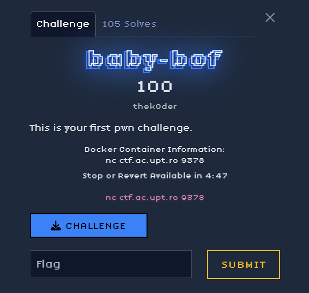

My first pwn challange that made sense. The first step was to download the binary and perform a basic analysis to understand what we were dealing with though file baby: ELF 64-bit LSB executable... then i did a checksec ad there was no PIE or other things active.

I opened the binary in a decompiler to analyze it.

main function: We observed that the program read user input into a local buffer using a vulnerable function like gets(), which does not check the input length.

win function: We discovered an additional function, named win, which, when called, would open and print the contents of the flag.txt file.

The objective became clear: to overflow the buffer in main with enough data to overwrite the return address on the stack and replace it with the address of the win function.

## Finding the Offset

I generated a string of characters: cyclic(200) then ran the program in GDB and sent the string as input.

The program crashed with a segmentation fault. We inspected the value in the RIP register, which contained a part of our string 

We used cyclic_find to translate that value back into a numeric offset

## Crafting the Exploit
Once we had the offset and the necessary addresses, we could build the final payload.

python3 -c "import sys; sys.stdout.buffer.write(b'A'*63 + b'B'*9 + b'\x96\x11\x40')"

