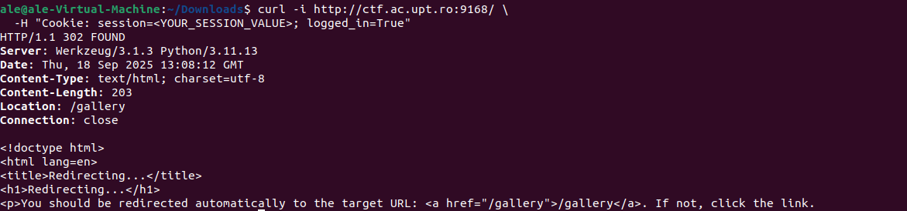

Initially I did the most basic command for inspection

I got the response: 
HTTP/1.1 302 FOUND
Location: /gallery
meaning that the server redirected us to /gallery, proving the tampered cookie granted access.

The site now looked like this:

Did some search and found this QR that you scan and find the flag 
